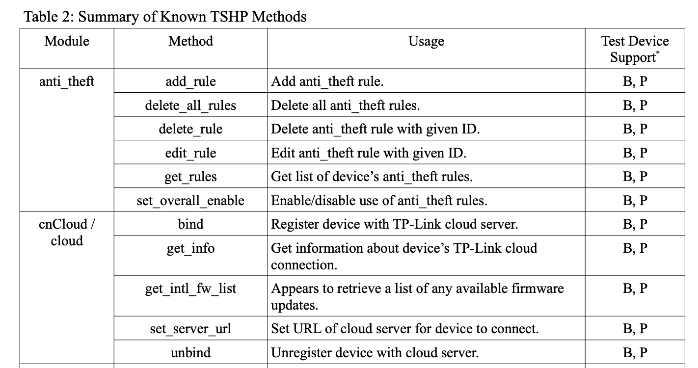

# Kasa Hasa Problem: Exploiting TP-Link HS-105 (Smart Wi-Fi Plug Mini)

Macy Huang, macyh@utexas.edu
03 January 2022

## Introduction
As someone whose only apartment window delivers dimly-lit views of the wall next door, the TP-link smart plug and paired Kasa app are invaluable to me for creating a kind of light alarm in the morning for early classes. Unfortunately, as a piece of software, it can be pretty hard to like. 

The Kasa app has easy-to-follow instructions for connecting the smart plug to the TP-link wifi network and a simple interface that allows users to control their smart plug or schedule it to activate at specific times. However, seemingly randomly, the plug fails to connect to the app and is deemed "offline" and "unreachable," despite the device receiving power and being within network range. I knew that IoT devices are generally security nightmares so in the spirit of my ethical hacking class, I decided to poke around and learn something about the hardware. My goal was to diagnose my connection issues and optimistically, find a way to stabilize the connection so my smart plug could become useable again.

## Research
I started by doing some research on the TP-Link smart plug model I have and seeing what existing exploits there are. I found information about reverse engineering a similar model - the TP-Link HS110 - and a few GitHub repositories where people had written APIs for interacting with their smart plugs. I couldn't find too much information on TP-Link smart plugs' internal hardware but I did learn generally how smart wifi plugs work. Wifi smart plugs often have a wireless module adapter with a TCP/IP stack, allowing the smart plug's microcontroller to communicate with the home network. Kasa happens to have an exploitable connection, as discovered by the [softScheck](https://www.softscheck.com/en/blog/tp-link-reverse-engineering/) blog, and I built upon this work to connect to my TP-Link device.

## Breaking In
Using the Kasa device's MAC address, I reverse-searched for its IP address using the Address Resolution Protocol command.
```
arp -a
```


I discovered that my smart plug was using the IP 192.168.1.65. In softScheck's work, they discovered that the smart device was using port 9999 to connect with the Kasa app using nmap, so given an IP and a port to start with, I started experimenting with connecting to the device using the socket library. I added a few command-line arguments using the Python argparse library, basing the flags on the different options I saw for commands in a research [paper I'd read that included TSHP](https://dr.lib.iastate.edu/server/api/core/bitstreams/30f5f6ac-993c-4356-8fce-19273e5d0731/content) commands. 



I decided to implement a few with my smart plug, particularly cloud set_server_url and unbind (since I had read that the cloud communication aspect of the device was somewhat exploitable) and netif get_scaninfo and get_stainfo to see nearby WiFi and get information about my WiFi network. Not to stray too far from the original point of my exploit, I also implemented some scheduling rule and system information request functions. These commands are JSON objects with a big-endian 4-byte payload prepended to them. The message is encrypted using an autokey XOR cipher and sent to the socket, and the device's response is decrypted with the same key (TP-Link uses 171). I had some trouble understanding how the XOR cipher worked and converting between types, but I eventually got the cipher to work (verifying with the [dcode.fr](https://www.dcode.fr/autoclave-cipher) encoder and decoder).

```python
def autokey(plaintext):
    key = INITIALIZATION_VECTOR
    result = bytes()
    for byte in plaintext:
        xor = key ^ byte
        key = xor
        result += bytes([xor])
    return result
```


## Conclusions and Future Work
Ultimately, I realized while working on this project that my connection issues were caused more by the smart plug's distance from my WiFi router than by any software or hardware issues the TP-Link HS-105 device has. I'm glad however to be able to improve on my home security and to have explored some of the functionality of my smart device. Having disconnected my smart plug from the "cloud" URL, I should be safer from Kasa's cloud server and possible data usage monitoring, though anyone with my WiFi password and my kasa.py program can still wreak havoc on my energy bill. The softScheck blog mentions a few other points of insecurity which may or may not be resolved since the article's original publication in 2016, not to mention the possibility for a DoS attack if an attacker spams requests to my smart device. To protect against these insecurities, I might in the future build my own TP-Link interface to not have to rely on Kasa or consider using a different network for my smart plug and any other IoT devices I own. Additionally, if I ever sell my smart plug, I am able to reset it and ensure that none of my data remains in the device for sanitization purposes, preventing people from accessing information about my location. I appreciate the granularity of control I now have over my smart plug and hope to be able to make my smart device a little bit smarter.

## Sources
[softScheck blogpost](https://www.softscheck.com/en/blog/tp-link-reverse-engineering/)
[storming the Kasa? security analysis of TP-Link Kasa smart home devices](https://dr.lib.iastate.edu/server/api/core/bitstreams/30f5f6ac-993c-4356-8fce-19273e5d0731/content)
[python-kasa](https://github.com/python-kasa/python-kasa)
[hacking TP-Link devices](https://troopers.de/downloads/troopers17/TR17_fgont_-iot_tp_link_hacking.pdf)